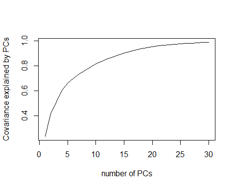
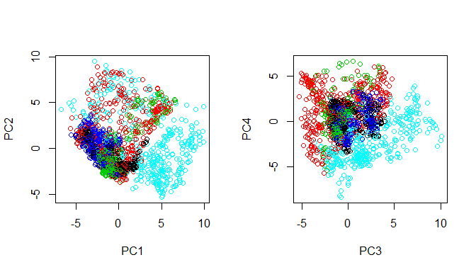
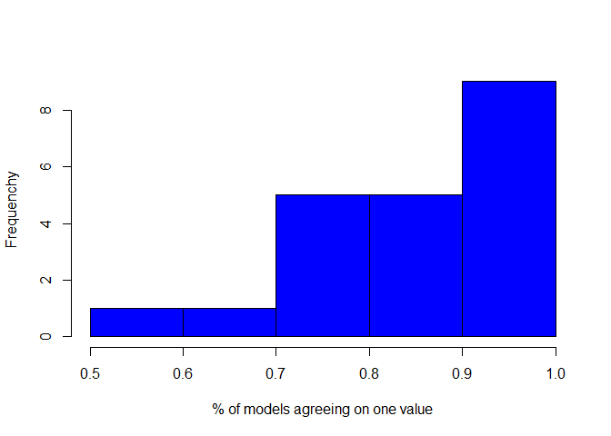

# Classification of quality of barbell lifts based on wearable sensor data
Vivek Yadav  
Saturday, September 20, 2014  
### Synopsis

This report presents implentation of a machine learning based algorithm to classify barbell lifting data obtained from wearable sensor. First raw data was processed to discard non-kineamtic data and remove variables without varitions. This resulted in a data set that was different for different people. Further, the raw kinematic (position-orientation-accelration-velocity etc) data depends on how the sensor is worn. To avoid variations due to differences in how sensors were worn, and differences in individual devices, a principal component (PCA) followed by support vector machine (SVM) model was fit to data of each person. PCA+SVM method was chosen because other methods like tree or rpart did not provide good classification. Collected data was split into training (40%), test (40%) and validation sets (20%). Cross-validation was perfomed using random sampling without replacements. To avoid issues of overfittig, a consensus based-model was implemented where 41 different models were fit to data, and consensus from these 41 models was used to identify the best solution. Overall, a good fit to data was observed (>98% accuracy) for all subjects, and all 20 final test cases were predicted correctly by the algorithm. 

#### Data was processed in following steps, 


1. First step was to exclude data that was non-numeric and was not collected. All columns without data were removed. Futher,there were spelling mistakes in 3 rows where 'pitch' was written as 'picth'.
2. Some people had some data missing. For example, jeremy had roll, pitch and yaw for arm (col: 15-17) missing, whereas adelmo had these measures for forearm (col:41-43) missing. 
3. Separate PCA-SVM model was fit to data of each person. PCAs were computed so as to explain 99% of covariance, this resulted in about 30 (against 52) predictors. 
4. Collected data was split into mode;-building (80%) and validation set (20%). 
5. In cross-validation, model-building data was randomly divided into equal parts, and 41 different models were fit.
6. Consensus between these models was chosen to obtain prediction. 
7. Accuracy and performance of model was tested and reported on validation set.


### Results

#### Principal components

 

Figure 1. Covarince explained by each variable. Cut off used here was 99% which gave about 30 PCs. 


 

Figure 2. The plots above indicate that it is may be possible to use classify classes (color coded) based on PCs.

41 svm models were fit to data. For each model, model-building set was divided into 2 equal parts, and svm was used to classify. A consensus between these models was used to obtain prediction from our model. 

### SVM performance on validation set. 

41 svm models were fit to data, a consensus between these models was used to obtain final prediction. The "odd" number 41 was chosen to avoid ties, although highly unlikely. 


 

Figure 3. Histogram of % of models that agreed on one prediction. 

In 522 number of cases in the validation set, there was disagreement between models in 21 cases. This was resolved using consensus between the models. Overall, the confusion matrix is reported below. This resulted in expected accuracy > 98%. 


```
## Confusion Matrix and Statistics
## 
##           Reference
## Prediction   A   B   C   D   E
##          A 125   2   0   0   0
##          B   0 100   1   0   0
##          C   0   0  95   6   0
##          D   0   0   0  81   0
##          E   0   0   0   1 111
## 
## Overall Statistics
##                                         
##                Accuracy : 0.981         
##                  95% CI : (0.965, 0.991)
##     No Information Rate : 0.239         
##     P-Value [Acc > NIR] : <2e-16        
##                                         
##                   Kappa : 0.976         
##  Mcnemar's Test P-Value : NA            
## 
## Statistics by Class:
## 
##                      Class: A Class: B Class: C Class: D Class: E
## Sensitivity             1.000    0.980    0.990    0.920    1.000
## Specificity             0.995    0.998    0.986    1.000    0.998
## Pos Pred Value          0.984    0.990    0.941    1.000    0.991
## Neg Pred Value          1.000    0.995    0.998    0.984    1.000
## Prevalence              0.239    0.195    0.184    0.169    0.213
## Detection Rate          0.239    0.192    0.182    0.155    0.213
## Detection Prevalence    0.243    0.193    0.193    0.155    0.215
## Balanced Accuracy       0.997    0.989    0.988    0.960    0.999
```


